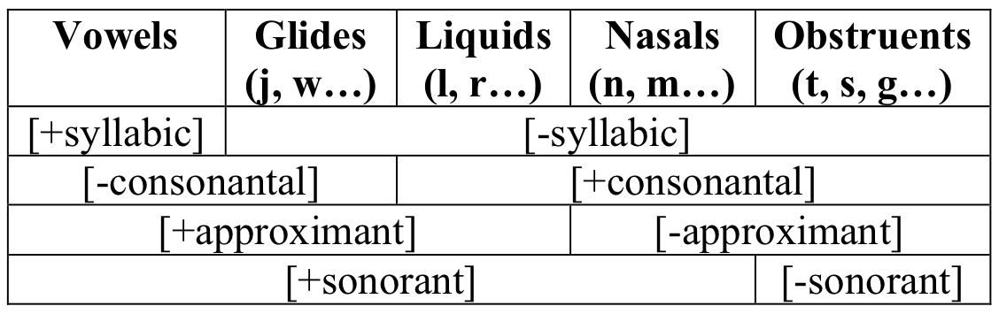

# Alternations and Features

## 3 Natural Classes and Distinctive Features

**Phonological processes or patterns:** affect <u>classes</u> of segments which share some crucial characteristic  

- defined over *natural classes* of segments  

**natural classes:** share a given (set of) phonetic features  

## 3.2 Features

**distinctive features:** shared by natural classes  

- binary: + or -  
- inventory can state all natural classes in phonological processes cross-linguistically  

Handy rule trick:  

​		[-cons, -back] -> [+back] / [-cons, + back] C_  

​		[-cons] -> [αback] / [-cons, αback] C_  

## 4.1 Major-Class Features

**major-class features:** define major sonority classes  

[consonantal], [sonorant], [approximant] tend to involve degree of constriction above the glottis  

## 4.2 Basic Manner Features

**[nasal]** velum lowered vs. raised   

**[strident]** airflow through groove in tongue blade and blown at teeth [f, s, ʒ] vs. other  

## 4.3 Place Features

**[LABIAL]** articulated with lips [p, b, f, v, β, m]  

**[CORONAL]** articulated with raised tongue tip or blade   

- **[anterior]** at alveolar ridge or forward [t, s] vs. behind [ʃ, ʒ]  
- **[distributed]** constriction that extends for a great distance [ʃ, t͡ʃ, ʒ] vs. does not extend [t, d, n, s, z]  
- **[lateral]** one or both sides of tongue held away from roof of mouth [l] vs. none

**[DORSAL]** articulated with tongue body - velars, uvulars, vowels  

- **[high]** high vowels, velars (uvulars are -high)  
- **[low]** low vowels  
- **[back]** back vowels, velars (palatals are -back)  
- **[ATR]**, **[tense] ** 

**[PHARYNGEAL]** articulated with the root of the tongue  

**[LARYNGEAL]**  

- **[voice]** vocal cords close enough to vibrate vs. none  
- **[spread glottis]** vocal cord config. produces audible glottal friction [pʰ, kʰ, h] vs. none  
- **[constricted glottis]** vocal cords tense and drawn vs. none  

