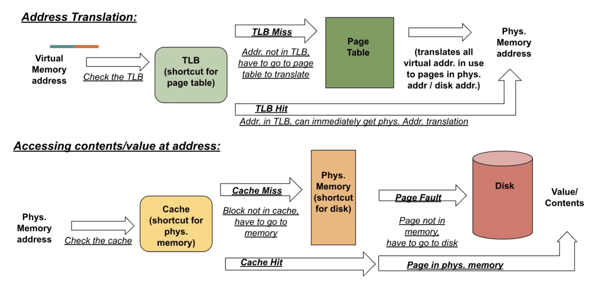

# OS & Virtual Memory

Motivation for VM

1. **Run multiple programs:** if everyone shares memory, each program needs to be aware of other programs
2. **Protection via isolation:** programs should not be able to read/write another program's memory
3. **Run a program larger than main memory:** illusion of having more memory than we really have
4. **All machines can have the same type of memory:** simulate address space for each process

| Program / Process                  | Memory Manager                         |
| ---------------------------------- | -------------------------------------- |
| sees full memory space as its own  | receives requests for data, gives data |
| memory is segmented into pages     | memory is segmented into pages         |
| speaks in virtual memory addresses | speaks in physical memory addresses    |

## Addressing

**Virtual Address (VA):** what your program uses (usually VPN > PPN)

**Physical Address (PA):** what actually determines where in memory to go

ex: 4 KiB pages and byte addresses

- 4 KiB = 2^12^ B = 4096 B ⟶ **12 page offset bits**

| Page Number | Page Offset                |
| ----------- | -------------------------- |
| which page  | which byte within the page |

Operation System is the translator between Virtual Memory and Physical Memory

- keeps a per process translation to maintain isolation

**Page Table:** what the translation is stored as

- stored in physical memory → so no need for additional translation → but lookups are slow
- maps VPN to PPN
- VPN stored <u>implicitly</u> → index into the Page Table

## Translation Lookaside Buffer (TLB)

Page Table Entry (PTE) is slow so → *Caching for the page table!*

- very small → fast lookups
- fully associative → eliminate conflict misses

TLB Entries

| TLB Valid | Tag (VPN) | Page Table Entry                     |
| --------- | --------- | ------------------------------------ |
|           |           | Page Dirty \| Permission Bits \| PPN |

Full Translation Process





 ## VM Access Pattern Example

16-bit addresses, 156 byte pages, 8-entry fully associative TLB (LRU)

**Free Physical Pages:** 0x17, 0x18, 0x19

| Access            | Result | Notes                                                        |
| ----------------- | ------ | ------------------------------------------------------------ |
| 1. 0x11f0 (Read)  | hit    | VPN 0x11, increment LRUs                                     |
| 2. 0x1301 (Write) | miss   | add to PTE since VPN not in TLB, replace line 2, valid, dirty (write) |
| 3. 0x20ae (Write) | hit    | dirty                                                        |
| 4. 0x2332 (Write) | miss   | add to PTE, replace line 5, valid, dirty                     |
| 5. 0x20ff (Read)  | hit    |                                                              |
| 6. 0x3415 (Write) | miss   | add to PTE, replace line 8, dirty                            |

TLB

| VPN         | PPN         | Valid | Dirty | LRU 0 | LRU 1 | LRU 2 | LRU 3 | LRU 4 | LRU 5 | LRU 6 |
| ----------- | ----------- | ----- | ----- | ----- | ----- | ----- | ----- | ----- | ----- | ----- |
| 0x01        | 0x11        | 1     | 1     | 0     | 1     | 2     | 3     | 4     | 4     | 5     |
| 0x00 → 0x13 | 0x00 → 0x17 | 0 → 1 | 0 → 1 | 7     | 7     | **0** | 1     | 2     | 2     | 3     |
| 0x10        | 0x13        | 1     | 1     | 1     | 2     | 3     | 4     | 5     | 5     | 6     |
| 0x20        | 0x12        | 1     | 0 → 1 | 5     | 5     | 6     | **0** | 1     | **0** | 1     |
| 0x00 → 0x23 | 0x00 → 0x18 | 0 → 1 | 0 → 1 | 7     | 7     | 7     | 7     | **0** | 1     | 2     |
| 0x11        | 0x14        | 1     | 0     | 4     | **0** | 1     | 2     | 3     | 3     | 4     |
| 0xac        | 0x15        | 1     | 1     | 2     | 3     | 4     | 5     | 6     | 6     | 7     |
| 0xff → 0x34 | 0xff → 0x19 | 1     | 0 → 1 | 3     | 4     | 5     | 6     | 7     | 7     | **0** |

PTE

| VPN      | PPN  | Valid |
| -------- | ---- | ----- |
| 0x13 (2) | 0x17 | 1     |
| 0x23 (4) | 0x18 | 1     |
| 0x34 (6) | 0x19 | 1     |

## VM Examples (Guerilla)

### <u>6 Size Calculation Practice</u>

4 GiB physical memory, 8 GiB virtual memory, 4 KiB page size

- physical mem: 4 GiB = 2^2^ * 2^30^ = 2^32^ ⟶ 32 bit PA ⟶ **20 bit PPN** 
- virtual mem: 8 GiB = 2^33^ ⟶ 33 bit VA ⟶ **21 bit VPN** 
- 4 KiB page size = 2^12^ ⟶ **12 bit offset**

64 MiB of virtual memory, 24 bit physical address space, 128 virtual pages

- virtual pages: 128 = 2^7^ ⟶ **7 bit VPN**
- virtual mem: 64 MiB = 2^26^ ⟶ 26 bit VA ⟶ **19 bit offset**
- 24 bit PA - 19 bit offset ⟶ **5 bit PPN**

256 MiB virtual memory, 512 physical pages, physical memory is double of virtual memory

- physical pages: 512 = 2^9^ ⟶ **9 bit PPN**
- physical mem: 2^29^ ⟶ 29 bit PA ⟶ **20 bit offset**
- virtual mem: 256 MiB = 2^28^ ⟶ 28 bit VA ⟶ **8 bit PPN**

cont. 1 KiB direct-mapped cache with a block size of 256 B

- block size: 256 B = 2^8^ ⟶ **8 bit offset**
- num blocks: 2^10^ / 2^8^ ⟶ **2 bit index**
- 29 bit PA - 10 bits ⟶ **19 bit tag**

### <u>7 Virtual Memory Fundamentals</u>

28 bit virtual address, 16 MiB physical memory (LRU), 4 KiB pages, fully-associative TLB with 16 entries (LRU)

- pages: 2^12^ ⟶ **12 bit offset**
- physical mem: 2^24^ ⟶ 24 bit PA ⟶ **12 bit PPN**
- 28 bit VA - 12 bit offset ⟶ **16 bit VPN**

``````
for (i = 0; i < max_replacements; i++) {
	dst[rand[i]] = src[rand[i]];
}
``````

Page faults after 20 iterations

- Best case: 0 page faults *(if all VPN-PPN pairings already in page table)*
- Worst case: 40 page faults *(all physical pages already used)*

Iterations of the loop before a TLB miss

- 16 TLB entries - 1 reserved ⟶ **15 usable entries**
- Best case: 15 entries * 2^12^ references
- Worst case: 0 iterations

### <u>Fall 2016 Final</u>

1 MiB physical memory, 16 pages, 19-bit virtual address; 256 B cache, 16 B blocks

- physical mem: 1 MiB = 2^20^ ⟶ 20 bit PA
- 20 = **12 bit tag** + **4 bit index** + **4 bit offset**
- physical mem / num pages (page size): 2^20^ / 2^4^ = 2^16^ ⟶ **16 bit page offset**  ⟶ **4 bit PPN**  ⟶ **3 bit VPN**

Page table stored at physical address 0x20200

- **(28) Valid Bit:** indicates whether a program has read / write access to the page
- **(24) Swap Bit:** indicates that the page has been swapped out to disk
- **(23-0) PPN**

*fill in table easily*

