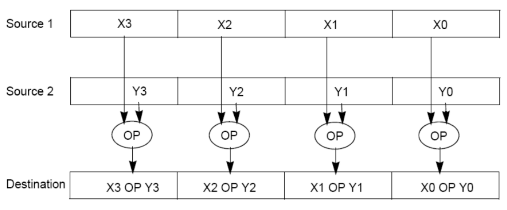
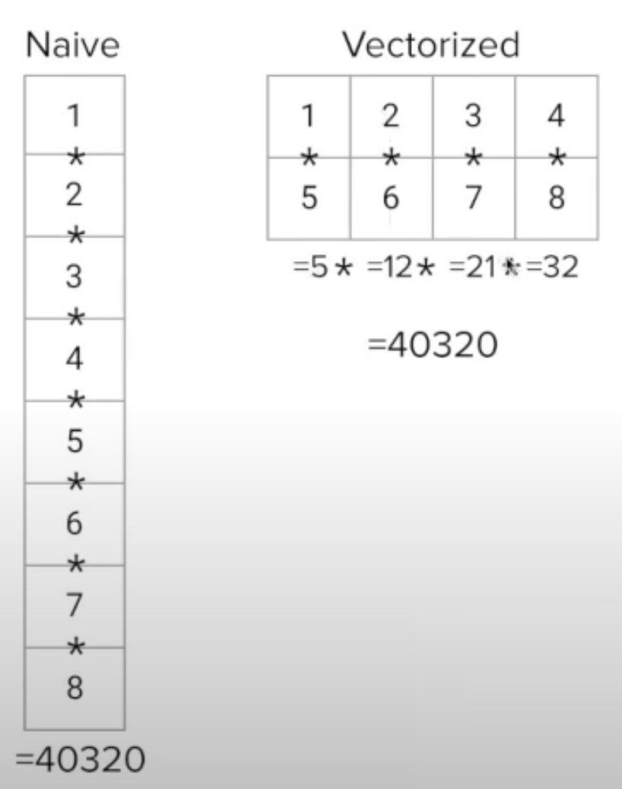

# Data Level Parallelism

## SIMD Prechecks

*SIMD: Single Instruction Multiple Data*

1. Not a form of instruction-level parallelism

   - perform the same instruction on multiple data points in parallel
   - ex: brightening every pixel in an image

2. Not ideal for flow-control heavy tasks (tasks with many branches/if statements)

   - flow-control disrupts the continuous flow of computation

   ``````
   // can set up 
   for (int i = 0; i < n; i++) {
   	product *= a[i];
   }
   
   // checking product at each iteration; cannot do partial products
   // however, can handle checks on each data point with masks
   for (int i = 0; i < n; i++) {
   	product *= a[i];
   	if (a[i] > 200)
   		// do something
   }
   ``````

3. Intel's SIMD intrinsic instructions invoke large registers available on the architecture in order to perform one operation on multiple values at once

   - e.g. treat a 128-bit register as four 32-bit "slots"

## Flynn's Taxonomy

| Process  | Breakdown                            | Hardware Example           | Software Example                    |
| -------- | ------------------------------------ | -------------------------- | ----------------------------------- |
| **SISD** | *single inst; single datastream*     | CPU                        | traditional programs                |
| **SIMD** | *single inst; multiple datastream*   | Intel SSE; vector computer | multimedia; scientific computations |
| **MISD** | *multiple inst; single datastream*   | N/A                        | N/A                                 |
| **MIMD** | *multiple inst; multiple datastream* | Modern CPU; datacenter     | multi-threaded programs; MapReduce  |

## Data-Level Parallelism

*vectorized calculation: applying operations to multiple items (part of a single vector) at the same time*



#### Intel Intrinsic Instructions

*all using 128-bit registers*

- **__m128i:** when the registers hold 4 ints, 8 shorts, or 16 chars
- **__m128d:** used for 2 double precision floats
- **__m128:** for 4 single precision floats
- epiXX: **e**xtended **p**acked **i**nteger, XX is the number of bits in the integer
  - epi32: 128-bit register is a pack of 4 32-bit integers

| Ret     | Function                                | Action                                                       |
| ------- | --------------------------------------- | ------------------------------------------------------------ |
| __m128i | _mm_set1_epi32 ( int i )                | set the four signed 32-bit ints within the vector to i       |
| __m128i | _mm_loadu_si128 ( _m128i *p )           | load the 4 succ. ints pointed to by p into 128-bit vector    |
| __m128i | _mm_mullo_si128 ( _m128i a, _m128 b )   | return vector *(a~0~b~0~, a~1~b~1~, a~2~b~2~, a~3~b~4~)*     |
| __m128i | _mm_add_si128 ( _m128i a, _m128 b )     | return vector *(a~0~+b~0~, a~1~+b~1~, a~2~+b~2~, a~3~+b~4~)* |
| void    | _mm_storeu_si128 ( _m128i *p, _m128 a ) | store 128-bit vector a at pointer p                          |
| __m128i | _mm_and_si128 ( _m128i a, _m128 b )     | perform a bitwise AND of the 128 bits in a and b             |
| __m128i | _mm_cmpeq_epi32 ( _m128i a, _m128 b )   | if a and b elems eq, ith elem of the ret vector set to 0xF…  |

#### Example 3.1: Filling in SIMD functions

*32-bit integers and 128-bit vector*

``````
int arr[8] = {1, 2, 3, 4, 5, 6, 7, 8};
__m128i vector = _mm_loadu_si128((__m128i *) arr);
``````

1. multiply vector by itself, and set vector to the result

   ``````
   vector = __mm_mullo_epi32(vector, vector);
   ``````

2. add 1 to each of the first 4 elements of the arr, resulting in arr = {**2, 3, 4, 5**, 5, 6, 7, 8}

   ``````
   __m128i vector_ones = _mm_set1_epi32(1);
   __m128i result = _mm_add_epi32(vector, vector_ones);
   __mm_storeu_si128((__m128i *) arr, result);	//need to typecast the arr
   ``````

3. add the second half of the array to the first half of the array; resulting in arr = {**6, 8, 10, 12**, 5, 6, 7, 8}

   ``````
   __m128i result = _mm_add_epi32(_mm_loadu_si128((__m128i *) (arr+4)), vector);
   __mm_storeu_si128((__m128i *) arr, result);
   ``````

4. set every element of the array that is not equal to 5 to 0; resulting in arr = {**0, 0, 0, 0,** 5, **0, 0, 0**}

   ``````
   // first half of already loaded array
   __m128i fives = __mm_set1_epi32(5);
   __m128i mask = _mm_cmpeq_epi32(vector, five);		// depends on if elements == 5
   __m128i result = _mm_and_si128(mask, vector);		// and to set to 0 or orig val
   _mm_storeu_si128((__m128i *) arr, result)
   // second half of unloaded array
   vector = _mm_loadu_si128((__m128i *) (arr+4));
   mask = _mm_cmpeq_epi32(vector, five);		// now with new vector
   result = _mm_and_si128(mask, vector);
   _mm_storeu_si128((__m128i *) (arr+4), result);
   ``````

#### Example 3.2: SIMD-ize Functions

<u>Observations:</u> no branches/if statements in for loop → ideal for vectorization

<u>Vectorize:</u> multiply 4 numbers at a time; aggregate 4 "sub-products" [p0, p1, p2, p3]; return p0 * p1 * p2 * p3

``````
static int product_naive(int n, int *a) {
	int product = 1;
	for (int i = 0; i < n; i++) {
		product *= a[i];
	}
	return product;
}
``````

``````
static int product_vectorized(int n, int *a) {
	int result[4];
	__m128i prod_v = __mm_set1_epi32(1);		// maintains 4 sub-products
	for (int i = 0; i < n/4 * 4; i+= 4) {
		prod_v = __mm_mullo_epi32(prod_v, __mm_loadu_si128(__m128i *) &a[i])		// perform mult
		// i-th element in arr must be loaded into special register
	}
	__mm_storeu_si128((__m128i *) result, prod_v);		//copy vector to int array
	
	// Tail case: if arr len not multiple of 4, apply non-vectorized operation on remaining elem
	for (int i = n/4 * 4; i < n; i++) {
		result[0] *= a[i];
	}
	
	return result[0] * result[1] * result[2] * result[3];
}
``````



