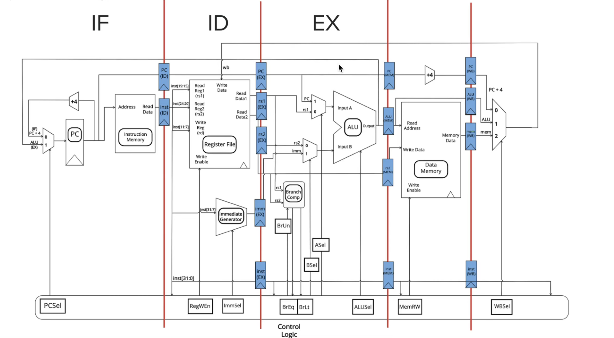

# RISC-V Pipelining and Hazards



## Pipelining Registers

Purpose of new registers: save values between stages; work that is done each stage

add +4 to the PC again in memory stage - jal/jalr need PC + 4 in WB stage

save instruction in a register multiple times - each stage has its own snapshot of execution - instruction bits are needed to determine correct control signals

**Latency:** the time it takes for one instruction to finish

- bottlenecked by the slowest stage 

**Throughput:** number of instructions processed per unit time

### Example (Sp 18 MT 2)

Max delays: IF = 200ns, ID = 150 ns, EX = 100 ns, MEM = 300 ns, WB = 250 ns

cycle time = 300 ns

- Latency:
  - 5 stages = 5 * 300 ns = **1500 ns**
- Throughput:
  - 1/cycle time = **1/300 ns**

*both latency and throughput increased with pipelining*

## Performance Analysis

|                  | Single Cycle | Pipelined   |
| ---------------- | ------------ | ----------- |
| fastest clk time | 950 ps       | 300 ps      |
| frequency        | 1.05 GHz     | 3.33 GHz    |
| latency          | 950 ps       | **1500 ps** |
| throughput       | 950 ps       | **300 ps**  |

950/300 = **3.2x**

- not 5x because adding clk-to-q / setup everytime (also hazards)

## Hazards

**Structural Hazards:** more than one instruction needs to use the same datapath resource at a time

- Register File: accessed both during <u>ID</u> when read and <u>WB</u> when written to
  - resolved with **double pumping:** can write first half, read second half
- Memory: accessed for both instructions and data
  - resolved with separate <u>IMEM</u> and <u>DMEM</u>
- **can always be resolved with more hardware**

**Data Hazards:** data dependencies between instructions

- when an instruction <u>reads</u> a register before a previous instruction has finished <u>writing</u> to that register

- **without forwarding** requires 3 stalls (without double pumping)

  - | Instruction        | C1   | C2   | C3   | C4   | C5   | C6   |
    | ------------------ | ---- | ---- | ---- | ---- | ---- | ---- |
    | sub **t1**, s0, s1 | IF   | ID   | EX   | MEM  | WB   |      |
    | or s0, t0, **t1**  |      | IF   | *    | *    | *    | ID   |

- **with forwarding** still cannot resolve **lw** (done after WB)
  
  - EX ⟶ EX :)
  - MEM ⟶ EX :(
    - need 1 stall *(see ex.2)*

**Control Hazards:** caused by jump and branch instructions

- PC is not PC + 4, but result is completed in EX stage
- stalling always works, but slow
- **branch prediction:** keep track of whether we branched or not <u>at this spot and predicts</u>
  - if we predict that we will branch, then we will load the label rather than PC + 4
  - if our prediction is wrong, we will flush the pipeline (NOP), and go to the proper instruction

## Hazard Fixes

### Example 1

**Forwarding:** result of EX or MEM stage is sent to the EX stage for a following instruction to use

<u>with forwarding</u> to fix data hazard

| Instruction            | C1   | C2   | C3       | C4       | C5       | C6   | C7   |
| ---------------------- | ---- | ---- | -------- | -------- | -------- | ---- | ---- |
| 1. addi t0, a0, -1     | IF   | ID   | **EX •** | MEM      | WB       |      |      |
| 2. add s2, **t0**, a0  |      | IF   | ID       | **• EX** | MEM      | WB   |      |
| 3. altiu a0, **t0**, 5 |      |      | IF       | ID       | **• EX** | MEM  | WB   |

*we know the value of t0 after EX and can then send to EX to fix both data hazards*

<u>without forwarding</u>

| Instruction        | C1   | C2   | C3   | C4   | C5   | C6   | C7   | C8   | C9   |
| ------------------ | ---- | ---- | ---- | ---- | ---- | ---- | ---- | ---- | ---- |
| 1. addi t0, a0, -1 | IF   | ID   | EX   | MEM  | WB   |      |      |      |      |
| 2. add s2, t0, a0  |      | IF   | *    | *    | *    | ID   | EX   | MEM  | WB   |

*would affect **three** instructions with data hazards*

<u>without forwarding with double pumping</u>

| Instruction        | C1   | C2   | C3   | C4   | C5     | C6   | C7   | C8   |
| ------------------ | ---- | ---- | ---- | ---- | ------ | ---- | ---- | ---- |
| 1. addi t0, a0, -1 | IF   | ID   | EX   | MEM  | **WB** |      |      |      |
| 2. add s2, t0, a0  |      | IF   | *    | *    | **ID** | EX   | MEM  | WB   |

*same cycle can write to WB and read from RegFile in ID - would affect two instructions with data hazards*

### Example 2

**Forwarding and Stalling:**

data hazard from **lw** instruction

| Instruction             | C1   | C2   | C3   | C4       | C5       | C6        | C7       | C8   | C9   |
| ----------------------- | ---- | ---- | ---- | -------- | -------- | --------- | -------- | ---- | ---- |
| 1. addi s0, s0, 1       | IF   | ID   | EX   | MEM      | WB       |           |          |      |      |
| 2. addi **t0**, t0, 4   |      | IF   | ID   | **EX •** | MEM      | WB        |          |      |      |
| 3. lw **t1**, 0(**t0**) |      |      | IF   | ID       | **• EX** | **MEM •** | WB       |      |      |
| 4. add t2, **t1**, x0   |      |      |      | *        | IF       | ID        | **• EX** | MEM  | WB   |

*only way to resolve is with a stall as well - result ready in MEM as opposed to EX*

**Rearranging Code:**

| Instruction           | C1   | C2   | C3       | C4       | C5        | C6       | C7   | C8   | C9   |
| --------------------- | ---- | ---- | -------- | -------- | --------- | -------- | ---- | ---- | ---- |
| 2. addi t0, t0, 4     | IF   | ID   | **EX •** | MEM      | WB        |          |      |      |      |
| 3. lw t1, 0(t0)       |      | IF   | ID       | **• EX** | **MEM •** | WB       |      |      |      |
| **1. addi s0, s0, 1** |      |      | IF       | ID       | EX        | MEM      | WB   |      |      |
| 4. add t2, t1, x0     |      |      |          | IF       | ID        | **• EX** | MEM  | WB   |      |

*instr 1 does not rely on the other instructions, so can act as the 1 stall needed for lw*

### Extra Example

<u>without forwarding with double pumping</u>

| Instruction           | C1   | C2   | C3   | C4   | C5     | C6        | C7   | C8     | C9   | C10  | C11  | C12  | C13  |
| --------------------- | ---- | ---- | ---- | ---- | ------ | --------- | ---- | ------ | ---- | ---- | ---- | ---- | ---- |
| 1. sub t1, s0, s1     | IF   | ID   | EX   | MEM  | **WB** |           |      |        |      |      |      |      |      |
| 2. or s0, t0, **t1**  |      | IF   | *    | *    | **ID** | EX        | MEM  | **WB** |      |      |      |      |      |
| 3. sw s1, 100(**s0**) |      |      | IF   | *    | *      | *ID free* | *    | **ID** | EX   | MEM  | WB   |      |      |
| 4. bgeu **s0**, s2, 1 |      |      |      |      |        | IF        | *    | *      | ID   | EX   | MEM  | WB   |      |
| 5. add t2, x0, x0     |      |      |      |      |        |           |      |        | IF   | ID   | EX   | MEM  | WB   |

*one instruction in a stage at once - control hazard between 4, 5*

## Detecting Data Hazards

``````
where:
	n: inst rd, rs1, rs2
	n+1: inst rd, rs1, rs2

if (rs1(n + 1) == rd(n) || rs2(n + 1) == rd(n) && RegWen(n) == 1) {
	forward ALU output of instruction n
}
``````

