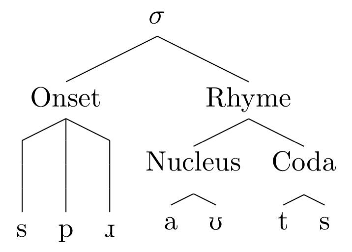

# Syllable

**Syllables (σ):** the structural units which provide melodic organization to strings of segments

- **onset (O):** everything that precedes the nucleus within a given syllable
- **nucleus (N):** the sonorous peak of the syllable; typically a vowel
- **coda (C):** everything that comes after the nucleus within a given syllable
- rhyme: nucleus plus the coda
- complex: if onset or coda contains more than one C

Types: ON, ONC, NC, N

Syllable Internal Structure

## Sonority

**The sonority hierarchy:** a putatively-universal ranking of segment types in order of their intrinsic sonority

- vowels > glides > liquids > nasals > fricatives > stops

**The Sonority Sequencing Principle (SSP):** for complex onsets and codas, segments closer to the nucleus should be more sonorous than segments farther from the nucleus

**Maximum Onset Principle:** make onsets as large as possible

- **open syllables:** lack a coda; **closed syllables:** have a coda
- **heavy syllables:** with a coda or long vowel

