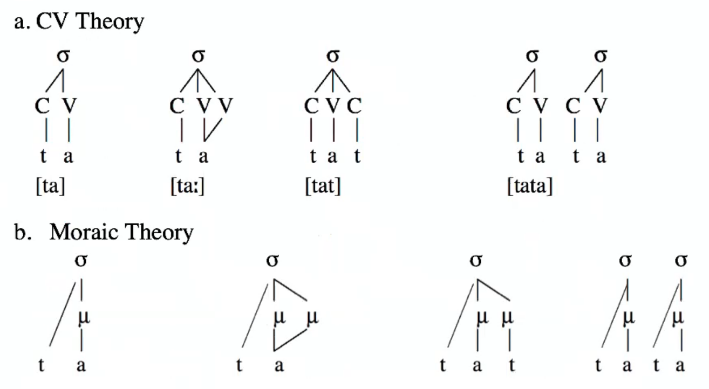

# Syllable Weight and Moraic Theory

**The Mora:** unit of syllable (prosodic) weight

- **light syllable** - monomoraic
  - without a long vowel
- **heavy syllable** - bimoraic
  - with a long vowel

| CV                                       | CVC                   | CVV                        |
| ---------------------------------------- | --------------------- | -------------------------- |
| light                                    | light <u>or</u> heavy | heavy                      |
| monomoraic                               | depends               | bimoraic                   |
| C is onset - never contributes to weight | coda can have mora    | two V slots each with mora |

### Japanese Haikus

Three lines: 5 moras, 7 moras, 5 moras

Onsets do not contribute to syllable weight; they do not bear moras

## Prosodic Morphology

**Reduplication:** copying segments

- English ex: moving very very slowly
- morpheme can be prefix, suffix, or infix

Reduplication Examples:

1. Hausa: **pluractional reduplication** - kik-kira, kak-karanta, bub-bùga *(template CVC)*
2. Yoruba: **gerundive reduplication** - gbí-gbóná, dí-dára *(tempate C)*
3. Madurese: **plural reduplication** - ỹãt-nẽỹãt, w̃ã-mõw̃ã *(template CV(C))*
4. Mokilese: reduplicant is a heavy syllable
5. Manam: reduplicate either two light (σσ) or one heavy (σ)
6. Diyari: reduplicate disyllabic foot (σσ)
7. Turkish: reduplicate word and replace onset with [m]

Truncation Examples:

8. Yapese: luʔag → luʔ, bayaad → bay, maŋɛɛfɛɛl → maŋ *(only leave first CVC)*
9. German: Stefanie → Steffie, Hans → Hansi *(to disyllabic foot - [σσ]~FOOT~ )*

CV Theory vs Moraic Theory

## Terminology

**Foot:** phonological constituent that is larger than the syllable and smaller than the word

- disyllabic (most common)
- stressed syllable within the foot is **strong**
- unstressed syllable is **weak**

**Trochee:** a left-dominant foot, where the <u>first</u> syllable is the stressed syllable

- ex: **ci**ty, (**ce**le)(**bra**tion)

**Iamb:** a right-dominant foot, where the <u>rightmost</u> syllable is the stressed syllable

