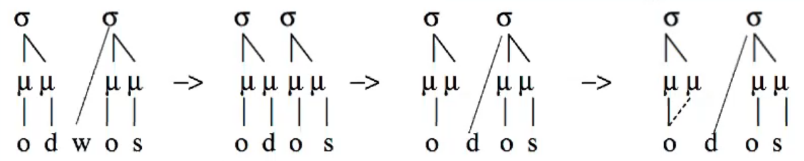

# Moraic Theory and Syllable Structure

Again:

| CV    | CVC                   | CVV   |
| ----- | --------------------- | ----- |
| light | light <u>or</u> heavy | heavy |

*Vowels project a mora universally, but differ on whether or not they assign moras to coda consonants (CVC)*

## Sonority Hierarchy

vowels > sonorants > obstruents

<u>Sets of syllabic segments</u> - what can be considered a syllable

- *vowels* (Lithuanian, Bulgarian)
- *vowels, sonorants* (English, Gonja)
- *vowels, sonorants, obstruents* (Imdlawn Tashlhiyt Berber)

<u>Sets of moraic segments</u> - what gives syllable weight

- *vowels* (Khalkha Mongolian, Yidiɲ)
- *vowels, sonorants* (Lithuanian, Kwakwala, Tiv)
- *vowels, sonorants, obstruents* (English, Latin, Arabic dialects)

Maximum moras in syllable: 3 (Hindi)

## Compensatory Lengthening (CL)

<u>Typology: Types of CL</u>

- "classical" CL (CVC → CV)
- double flop: the deletion of a post-consonantal onset resulting in the lengthening of the preceding vowel
- CL through vowel loss
- CL from glide formation (/ia/ → [jaː])
- CL by prenasalization (schematically, /amba/ → [aː^m^ba])

Examples:

1. Lithuanian *n*-deletion: s**un**sti → s**u**sti; u ends up linking to VC
   - n → ∅ / __C
   - u then can link to both μμ´ *(where μ´ is a segmentally unaffiliated mora)*
2. Ancient Greek w-loss: woikos → oikos
   - Ionic: *odwos → oːdos
   - **double flop** in Ionic Greek; **resyllabification** of the d

3. Samothraki Greek…