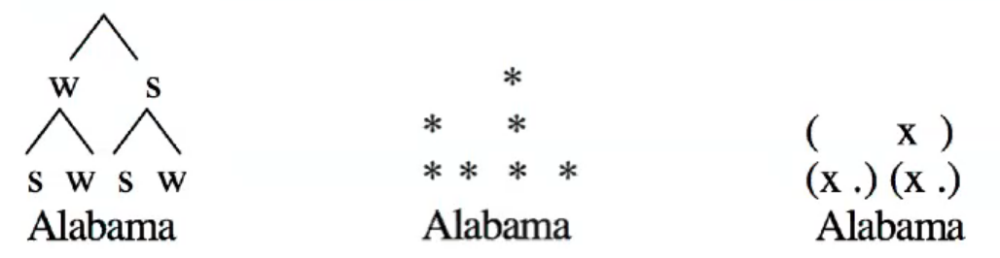

# Stress

**Syllable:** a constituent that groups together <u>sements</u>

- each syllable has one peak - **nucleus**

**Metrical foot:** a constituent that groups together <u>syllables</u>

- each metrical foot has one peak - **stress**

<u>Characteristics of stressed syllables</u>

- Cross-linguistic phonetic: greater duration, greater amplitude, greater magnitude of articulatory gestures
- Phonological: locus of tone assignment, vowel lengthening, lack of vowel reduction, coda attraction
- **culminative:** there is one and only one maximally prominent peak within a stress domain
- **demarcative:** signals the beginning and/or end of morphological boundaries
- **relational:** one syllable has more stress than another *(re'cord, per'mit (V); 'record, 'permit (N))*
- comes in **degrees**: usually one <u>primary</u> stress and other <u>secondary</u> stresses

*Conclusions:*

- Stress is a *phonological organizing principle* without consistent phonetic correlates
- Stress isn't a binary feature ([+stress] or [-stress]); stress is a *structural relation*

## Diagnostics of Stress

### Attraction of Nuclear Intonational Tone

- assimi'lation. (M M H* L) - *statement*
- assimi'lation? (M M L* H) - *question*
- assimi'lation. (H H M* L) - *judicious downstepping*
- assimi'lation. (L L LH* L) - *exclamation*

- **Surprise-redundancy contour:** H L* H* L   *(L* on secondary stressed word)*
  - The ˌblackboard's ( H L* ) painted 'orange ( H* L )!
- **Vocative intonation:** L H* M*   *(M* on secondary stressed vowel through final)*
  - Vir'ginia!; Ale'xander! ( L H* M* ); 'Pamela! ( H* H M* )

### Segmental Effects

1. **Vowel reduction** - *medicine* ['mɛdəsən]
2. **Flapping** - *attainability* [ətejnə'biliɾi]
3. **[t]-insertion** - *insane* [ɪn'sejn], *[ɪnt'sejn]
4. **/l/ devoicing** - *Iceland* ['ajsl̥ənd], *Icelandic* [ˌajs'lændɪk]
5. **Medial aspiration** - *ap'pend* [pʰ], '*apple* [p] ; *a'ccost* [kʰ], 'chicken [k]

### Rhythm Rule of English

**Iambic reversal:** stress is shifted from <u>a later to an earlier</u> syllable in a word occurring within a phrase; avoid clash between adjacent stresses

- thir'teen vs. 'thirteen men
- good-'looking vs. 'good-looking girl

## Sound Pattern of English

*Stress is <u>n-ary</u> valued feature; only one vowel in a rule domain can have 1stress*

1. **Phrasal stress:** on last word - *red 'cows*
2. **Compound stress:** - *'blackboard*
3. **Nuclear stress:** assign [1stress] to rightmost vowel bearing [1stress]
4. **Compound stress:** skip rightmost word, then assign [1stress] to rightmost visible [1stress], if any. If not, then don't skip rightmost word and try again

<u>Advantages of Relational Treatment</u>

- Stress feature is *binary*, not n-ary
- Single phonetic correlate of relative prominence is not expected
- Explains some typological properties of stress
  - Obligatoriness
  - Rhythmic distribution
  - Hierarchical nature

*1980 ⟶ Arboreal representations replaced with the notion of **foot***

<u>Foot typology</u>

- (. x) - **iambic**
- (x .) - **trochaic**

<u>Arboreal</u> vs <u>Metrical Grid</u> vs <u>Stress/Feet</u> Treatments

