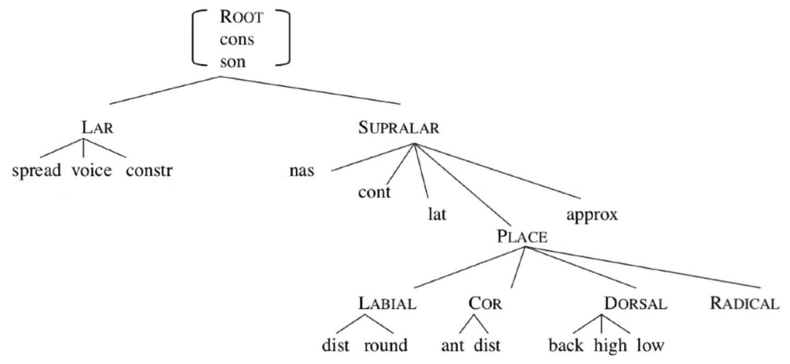

# Feature Geometry

1. **Complete assimilation** in Biblical Hebrew
   - **k**aa**t**ab → yi-**kt**ob, **n**aa**p**al → yi-**pp**ol, **n**aa**t**an → yi-**tt**en
2. **Partial assimilation** in English
   - advisable → i[n]advisable, possible → i[m]possible

Feature Geometry Tree

*but many arguments - place for [Lateral]*

## Examples

1. **London English:** *'picture'* pɪ**ʔk**tʃə → pɪ**ʔ**tʃə, *'not now'* nɔ**ʔt** næʊ → nɔ**ʔ** næʊ
   - LAR used, SUPRALAR ignored
2. **Semitic gutturals:** as a natural class
   - laryngeals [h ʔ], pharyngeals [ħ ʕ], uvulars [χ ɣ]
3. **Laryngeal transparency:** [h] transparent, [p] opaque
   - vowels can assimilate across [h ʔ]

