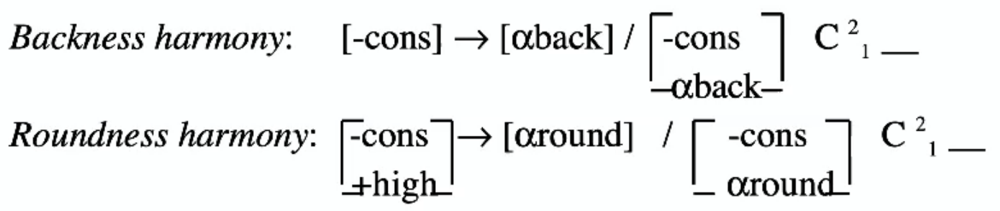
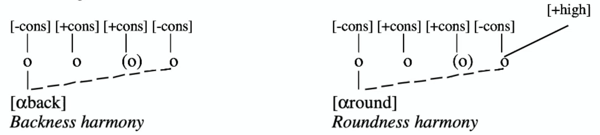

# Vowel Harmony

the phenomenon whereby vowels in different syllables are required to agree with respect to one or more distinctive features

### Turkish Vowel Harmony

**plural suffix:** -lAr [-high, -round, ∅back]   *(-lar / -ler)*

**accusative suffix:** [+high, ∅back, ∅round]   *(-ɯ / -u / -i / -y)*

<u>Vowel Inventory</u>

|           | -back      |            | +back      |            |
| --------- | ---------- | ---------- | ---------- | ---------- |
|           | **-round** | **+round** | **-round** | **+round** |
| **+high** | i          | y          | ɯ          | u          |
| **-high** | e          | ∅          | ɑ          | o          |

<u>The Rules</u>

1. SPE notation

1. Autosegmental notation
   - roundness only spreads if [+high]

### ATR Examples

*tense/lax harmony*

1. **Igbo**

   - spreads bidirectionally from the root
   - [-ATR] æ-[zʊ]-læ; [+ATR] e-[ke]-le

2. **Diola Fogny** 

   - [-ATR] if word made of only alternating morphemes
   - [+ATR] if non-alternating morpheme, it will spread
     - [baj]-ɛn (-, -) → [bəj]-**ul** (+, +)

3. **Kinande**

   - [-cons] → [+ATR] / _ C [-cons, +ATR]

     ​            → [-ATR] / elsewhere

4. **Nzebi**

   - weird

# Nasal Harmony

the long-distance spread of nasality from a vowel or consonant to another vowel or consonant

- **transparent segment:** does not prevent some phonological process, such as assimilation, from applying across
- **opaque segment:** regularly prevents the spread of harmony (assimilation) through it

Examples

1. **Sundanese**
   - <u>trigger:</u> nasal, <u>target:</u> vowel
   - kumã**h**ã, mĩ**ʔ**ã**s**ih - *[h ʔ] are transparent*
   - nã**j**ak, mã**w**ur - *other consonants opaque*
2. **Warao**
   - <u>trigger:</u> nasal, <u>target:</u> vowels, glides, h
   - mẽh̃õ**k**ohi - *stops are opaque*
3. Coatzospan Mixtec
4. 2^nd^ familiar formation
   - final vowel nasalized, spreads left
   - ku**t**ũ - *voiceless stops are opaque*
   - kã**ʔm**ũ, ðĩ**n**ĩ**ⁿd**ũ - *everything else transparent*

# Consonant Harmony

phonologically conditioned long-distance assimilation of features from one consonant to another

- much rarer than vowel and nasal harmony
- common types: **coronal** and **laryngeal**

Examples

1. **Chumash**
   - coronal consonants [s, ʃ, c, tʃ] assimilate in <u>[distributed]</u> to the rightmost relevant consonant in the word
     - s [-dist, +ant], ʃ [+dist, -ant]
   - suffix passes left
   - k-**s**unons-u**s** → k-**ʃ**unon-**ʃ**
   - ha-**s**-xintila → ha-**ʃ**-xintila-wa**ʃ**
2. **Tahltan** coronal harmony
   - /s/ assimilates in place to [θ] or [ʃ] if followed by member of /dð/ or /dʒ/ series
     - θɛ**θ**<u>ð</u>ɛɬ, nɑ**θ**<u>tθʼ</u>ɛt - *s → θ followed by /dð/ series*
     - e**ʃ**<u>dʒ</u>mi, ɬɛnɛ**ʃ**<u>tʃ</u>uːʃ - *s → ʃ followed by /dʒ/ series*
   - /θ/ assimilates in place to [s] or [ʃ] if followed by member of /dz/ or /dʒ/ series