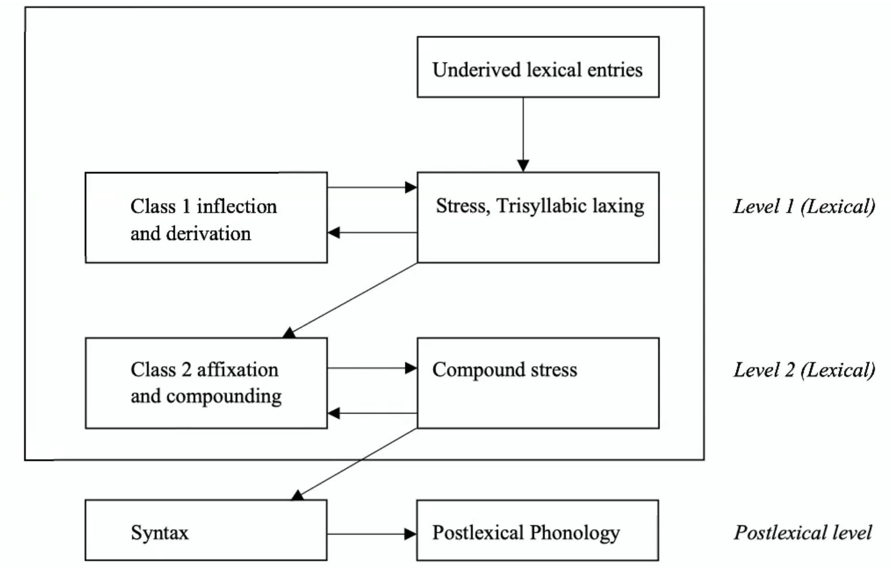

# Cyclicity and Levels

application of *phonological* processes interleaved with application of *morphological* processes

- level ordering: association of phonolgical alternations with morphological "zones"

**cyclicity:** phonology applies to <u>output</u> of each morphological process

**noncyclicity:** phonology applies <u>only at the end</u> of the morphological component

### Phonological Evidence for Cyclicity

1. **English** stress and stress-related aspiration/flapping

   | *compensation*       | *condensation*       |
   | -------------------- | -------------------- |
   | còmpensátion         | còndènsátion         |
   | [ [cómpensàte] -ion] | [ [condénse] -ation] |

   | *militaristic*              | *capitalistic*            |
   | --------------------------- | ------------------------- |
   | mìli**[tʰ]**arístic         | càpi**[ɾ]**alístic        |
   | [[ [míli [tʰ] àry] ist] ic] | [[ [cápi [ɾ] al] ist] ic] |

   - *different bases, different suffixes - affects stress differently*

2. **Turkish** epenthesis

   - *phonology (epenthesis) applies every time a suffix is added (on each suffix 'cycle')*

### Phonological Evidence for Noncyclicity

*some rules are postcyclic (word-level)*

1. **Turkish** final devoicing
   - /kanad/ → [kana**t**], [kana**d**-a], [kana**d**-ɯm]
2. **Choctaw** stress
   - /sa-litiha-tok/ → (sa.lí)(ti.há)(tók)
   - iambic; either (σ́~μμ~) (σ~μ~σ́~μ~)

### This Seems Messy…

Some rules…

1. are cyclic (apply at every step of affixation)
2. are morphologically conditioned
3. care about morpheme boundaries
4. *are none of the above!*

## Level-Ordering

Kiparsky's theory divides the morphological grammar into two ordered subcomponents

- **lexical:** cyclic rules which can be morphologically conditioned, applied cyclically, sometimes have lexical exceptions
  - rules whose application is sensitive to morphilogical/lexical context of the phonological string
- **postlexical:** apply once per word, not morphologically sensitive
  - rules that are not sensitive to morphilogical/lexical context of the phonological string

### English Level Ordering

- **Levels**

  - <u>Level 1:</u> Class 1 derivation, inflection
    - *stress assignment, nasal place assimilation, trisyllabic laxing*
  - <u>Level 2:</u> Compounding, Class 2 (#-boundary) derivation, inflection
    - *final cluster simplification*

- **Derivational affixes**

  - <u>Class 1:</u> *-al, -ty, -ic, ive, -ion, -ate, -ous, in-, con-, pre-, en-, de-, re-,…* [Latinate]
  - <u>Class 2:</u> *-ness, -hood, -less, -ful, re-, un-, non-, under-,…* [Germanic]

- **Semantic generalizations**

  - <u>Class 1:</u> often irregular, less productive
  - <u>Class 2:</u> regular, more productive

- **Ordering generalizations**

  | root+I+I          | root+I#II         | root#II#II        | *root#II+I        |
  | ----------------- | ----------------- | ----------------- | ----------------- |
  | *act+iv+ate*      | *act+ion#less*    | *hope#less#ness*  | **hope#less+ity*  |
  | **I+I+root**      | **II#I+root**     | **II#II#root**    | ***I+II#root**    |
  | *in+con+ceivable* | *non#con+formity* | *non#re#fillable* | **ir#re+fillable* |

  - *Class 1 always closer to the root than Class 2*

- **Phonological generalizations**

  - STRESS

    | root         | Class 1 suffix *(stress-changing)* | Class 2 suffix *(stress-neutral)* |
    | ------------ | ---------------------------------- | --------------------------------- |
    | p**á**rent   | parént+al                          | p**á**rent#hood                   |
    | **í**nfinite | infínit+ude                        | **í**nfinite#ness                 |

  - NASAL PLACE ASSIMILATION

    | Class 1 /in-/        | Class 2 /un-/    |
    | -------------------- | ---------------- |
    | **ir**-resolute      | **un**-wrap      |
    | **il**-legal         | **un**-lawful    |
    | **i{n,ŋ}**-congruous | **u{n,ŋ}**-clasp |

  - TRISYLLABIC LAXING

    | root        | Class 1       | Class 2          |
    | ----------- | ------------- | ---------------- |
    | [ej] opáque | [æ] opác-ity  | [ej] opáque#ness |
    | [aj] divíne | [ɪ] divín-ity | [aj] divíne#er   |

  - NG, MB SIMPLIFICATION

    | root     | Class 1       | Class 2      |
    | -------- | ------------- | ------------ |
    | [m] iamb | [mb] iamb+ic  | [m] iamb#s   |
    | [ŋ] long | [ŋg] long+est | [ŋ] long#ing |

  - G-DELETION

    | root       | Class 1         | Class 2        |
    | ---------- | --------------- | -------------- |
    | [n] sign   | [gn] sign+al    | [n] sign#er    |
    | [n] malign | [gn] malign+ant | [n] malign#ing |

  - N-DELETION

    | root     | Class 1      | Class 2    |
    | -------- | ------------ | ---------- |
    | [m] hymn | [mn] hymn+al | [m] hymn#s |

Lexical Phonology of English

