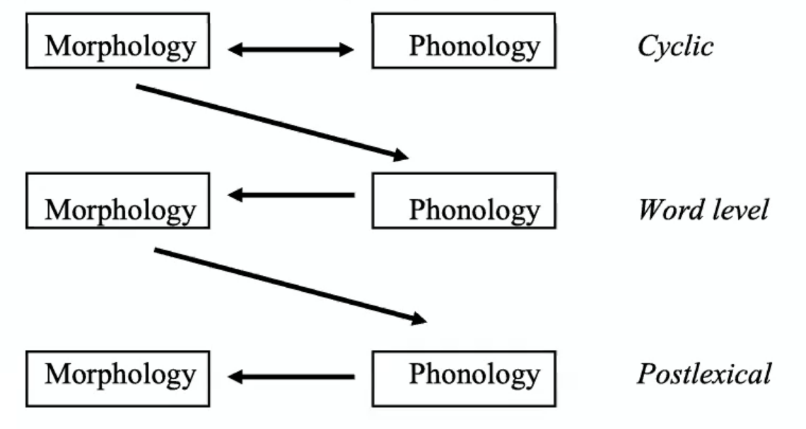

# Lexical Phonology and Morphology

1. **Finnish**
   - /t/ → [s] / _i
     - **t**ila, æi**t**i - *but does not apply to roots*
   - /e/ → [i] / _# (vowel raising)
     - ve**si**, ve**te**-næ - *vowel raising and then t to s*

**derived environment:** segment in derived environment with respect to a phonological rule R if either:

1. the effects of an earlier phonological rule <u>created the environment that now satisfies the rule</u>
2. the material that satisfies the environment of rule R <u>belongs to two different morphemes</u>

**derived environment rule:** rule that applies only in a derived environment

| Lexical rules                                 | Postlexical rules                                  |
| --------------------------------------------- | -------------------------------------------------- |
| may refer to <u>morphological</u> information | statable in purely <u>phonological</u> terms       |
| may have exceptions                           | exceptionless                                      |
| structure-preserving                          | not always structure-preserving                    |
| accessible to native-speaker intuitions       | not always accessible to native-speaker intuitions |
| cannot apply across word boundaries           | may apply across word boundaries                   |

The "Factory" Model

Examples

1. **Catalan** cyclic phonology
   - First cycle: nasal assimilation, cluster simplification
   - Second cycle: nasal assimilation
2. **Spokane** repetitive
   - prefix repetitives: copies CV *(e or a as V)*
   - infix repetitives: repetitive is vowel which is infixed between CC
   - infixation after vowel deletion: (1) assign stress (2) delete vowel so CC (3) add repetitive
3. Bracketing Paradoxes
   - [<u>[un [grammatical]]</u> ity] vs [un <u>[[grammatical] ity]</u>]

# Opacity in Phonology

## 1. Tiberian Hebrew opaque rule interaction

- <u>epenthesis:</u> ∅ → e / C_C
- <u>/ʔ/-deletion:</u> ʔ → ∅ / __]~σ~
- /deʃʔ/ → deʃeʔ → [deʃe]
  - *epenthesis breaks up consonant clusters, but only one consonant surfaces*
  - non-surface-apparent; overapplication (epenthesis); counterbleeding

### OT Constraints

1. CODACOND: no [ʔ] in coda position
2. *COMPLEX: syllable margins are simple
3. DEP-V:  vowels in the ouput have correspondent in the input *(no epenthesis)*
4. MAX-C: consonants in the input have a correspondent in the ouput *(no deletion)*

| /deʃʔ/   | CODACOND | *COMPLEX | MAX-C | DEP-V |
| -------- | -------- | -------- | ----- | ----- |
| **deʃe** |          |          | *     | *!    |
| deʃ ⟵    |          |          | *     |       |
| deʃeʔ    | *!       |          |       | *     |
| deʃʔ     | *!       | *        |       |       |

*candidate that should become optional is <u>harmonically bounded</u>: cannot under any ranking become optimal since it violates the constraints*

### Stratal OT

- different optimization cycles with (potentially) different constraint rankings
- the output of one optimization is input into another optimization
- every optimization cycle/stratum correspons to a morphological domain

<u>Stratum 1</u> (stem or word level)

| /deʃʔ/      | *COMPLEX | MAX-C | DEP-V | CODACOND |
| ----------- | -------- | ----- | ----- | -------- |
| deʃʔ        | *!       |       |       | *        |
| deʃ         |          | *!    |       |          |
| deʃe        |          | *!    | *     |          |
| **deʃeʔ** ⟵ |          |       | *     | *        |

<u>Stratum 2</u> (word or phrasal level)

| deʃeʔ      | CODACOND | *COMPLEX | MAX-C | DEP-V |
| ---------- | -------- | -------- | ----- | ----- |
| deʃeʔ      | *!       |          |       |       |
| **deʃe** ⟵ |          |          | *     |       |

### 2. Bedouin Hijazi Arabic opaque rule interaction

- <u>raising:</u> a → i / __]~σ~
- <u>glide vocalization:</u> w → u / C_
- /badw/ → badw → [ba.du]
  - *no raising, although the context is given at the surface*
  - non-surface-true; underapplication (raising); counterfeeding

